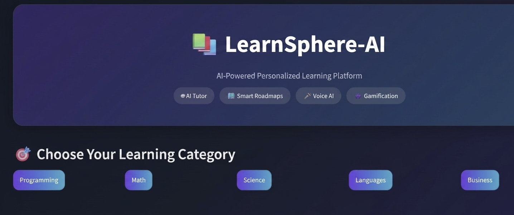
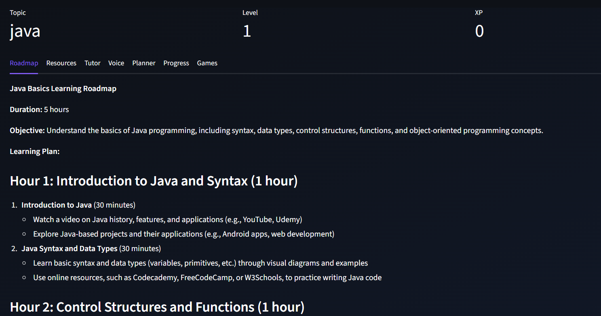
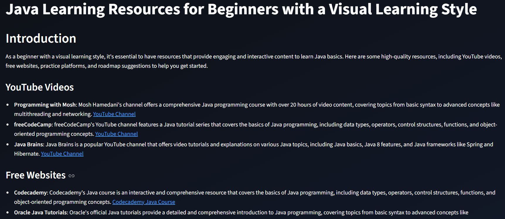
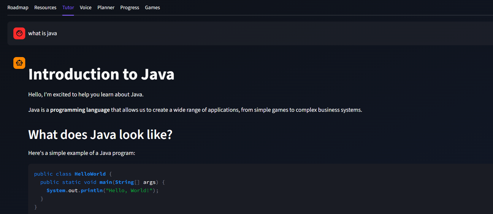
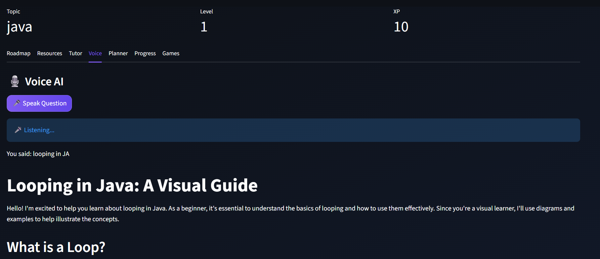
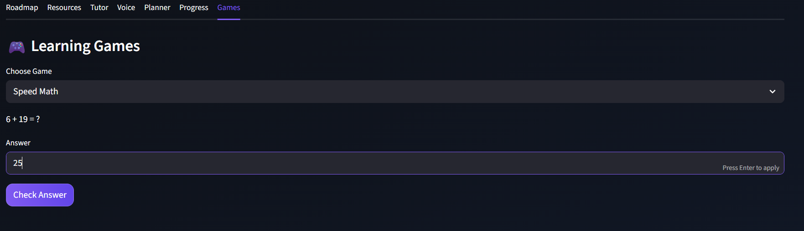

# LearnSphere-AI — AI Study Assistant

LearnSphere AI is a personalized AI learning platform powered by a multi-agent system.
It helps students build structured learning roadmaps, understand concepts, get curated resources, and improve learning efficiency through an interactive AI-driven experience.

---

## Overview

LearnSphere AI is a full-stack AI study assistant that combines multiple intelligent agents to guide a learner from beginner to mastery.

It provides:

* Personalized learning roadmaps
* AI tutoring and explanations
* Curated learning resources
* Study planning tools
* Interactive learning experience

All powered through a multi-agent pipeline system.

---

## Features

* Student profiling for personalized learning paths
* AI-generated structured roadmaps
* Curated learning resources
* AI tutor for doubt solving
* Study planner (tasks and tracking)
* Progress tracking system
* Simple learning-based games
* Voice input and output support (optional)
* Streamlit-based interactive UI

---

## Architecture

```text
User Input
↓
Agent Handler (Orchestrator)
↓
Student Analyzer Agent
↓
Roadmap Generator Agent
↓
Resource Finder Agent
↓
Tutor Agent (Chat Context)
↓
Streamlit Dashboard (UI)
```

Each agent performs a specific role and passes structured output to the next stage.

---

### Home Screen



### Roadmap View



### Resources View



### AI Tutor



### Voice Assistant



### Games



---

## Agent Roles

### Student Analyzer Agent

Analyzes the learner’s goal, topic, and current understanding level.

### Roadmap Generator Agent

Creates a structured step-by-step learning plan with milestones.

### Resource Finder Agent

Finds relevant free learning materials from the web.

### Tutor Agent

Acts as an interactive AI tutor for doubt solving and explanations.

---

## Tech Stack

* Python
* Streamlit
* LLM APIs (Groq / OpenAI)
* LangChain
* YAML Prompt Engineering
* DuckDuckGo Search
* SpeechRecognition
* pyttsx3

---

## Project Structure

```text
LearnSphere_AI/
├── app.py                  # Streamlit UI
├── agent_handler.py       # Multi-agent orchestration logic
├── rag_helper.py          # Helper utilities (optional module)
├── prompts.yaml           # Prompt templates for agents
├── config.py              # Configuration manager
├── requirements.txt       # Python dependencies
├── pyproject.toml         # Project metadata
├── setup.bat              # Windows setup script
├── .env                   # API keys (not committed)
└── .gitignore             # Ignored files and folders
```

---

## Getting Started

### Clone the repository

```bash
git clone https://github.com/YOUR_USERNAME/LearnSphere-AI.git
cd LearnSphere-AI
```

---

### Create virtual environment

```bash
python -m venv venv
venv\Scripts\activate
```

---

### Install dependencies

```bash
pip install -r requirements.txt
```

---

### Add environment variables

Create a `.env` file in the root directory:

```text
OPENAI_API_KEY=your_key_here
GROQ_API_KEY=your_key_here
```

---

### Run the application

```bash
streamlit run app.py
```

---

## How It Works

User selects a subject and learning goal
↓
Student Analyzer processes the input
↓
Roadmap Generator builds a structured plan
↓
Resource Finder collects relevant materials
↓
Tutor Agent handles interactive queries
↓
Dashboard displays results

---

## Use Cases

* Exam preparation planning
* Structured self-learning
* Skill development roadmap creation
* AI-powered tutoring assistant

---

## Roadmap

* Persistent user memory system
* PDF-based learning support
* Spaced repetition system
* Mobile application version
* Cloud deployment

---

## Author

RIGASWAR

AI/ML Developer | LLMs | Multi-Agent Systems

---

## License

This project is licensed under the MIT License.

You are free to use, modify, and distribute this project for personal or commercial use with proper attribution.

See the LICENSE file for more details.
